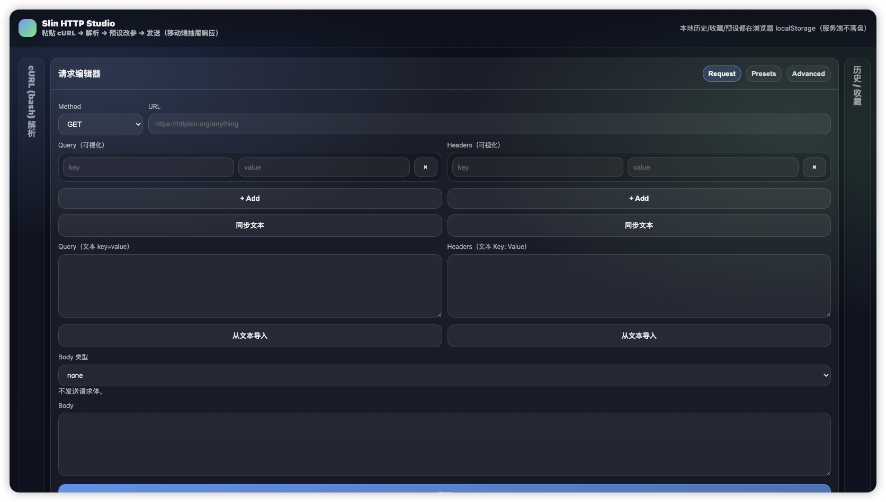
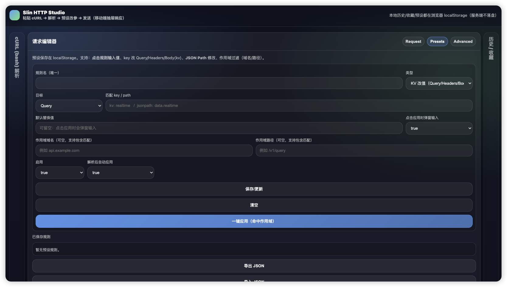
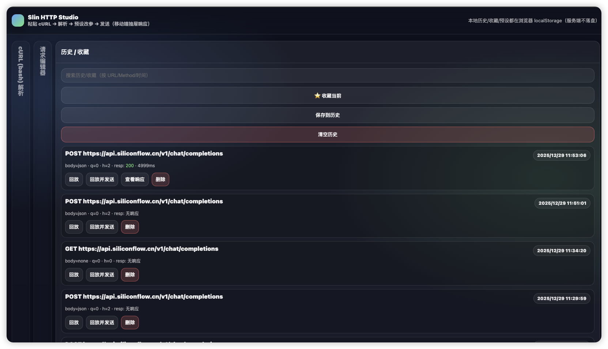

# Slin HTTP Studio

一个功能强大的 HTTP 请求测试工具，支持 cURL 解析、请求编辑、预设规则、历史记录等功能。基于 Flask + 原生 JavaScript 构建，提供现代化的 Web 界面和完善的安全防护。

## 功能演示

### cURL 解析
从浏览器开发者工具直接粘贴 cURL 命令，自动解析为可编辑的请求表单。


### 请求编辑器
支持多种 HTTP 方法、Query 参数、Headers 和 Body 类型的可视化编辑。



### 预设规则系统
配置智能预设规则，支持 KV 改值和 JSON Path 深层修改，可按域名和路径过滤作用域。



### 历史记录与收藏
自动保存请求历史和响应数据，支持收藏、搜索和一键回放。



## 核心特性

### 1. cURL 解析
- 支持从浏览器开发者工具直接粘贴 cURL 命令（Copy as cURL bash）
- 自动解析 URL、请求方法、Headers、Query 参数、Body 等
- 支持多种 cURL 选项：
  - `-X` / `--request`: HTTP 方法
  - `-H` / `--header`: 请求头
  - `-d` / `--data` / `--data-raw` / `--data-binary`: 请求体
  - `--data-urlencode`: URL 编码数据
  - `--json`: JSON 数据（自动设置 Content-Type）
  - `-F` / `--form`: multipart/form-data
  - `-b` / `--cookie`: Cookies
  - `-u` / `--user`: Basic 认证
  - `-x` / `--proxy`: 代理设置
  - `-k` / `--insecure`: 跳过 SSL 验证
  - `-L` / `--location`: 跟随重定向
  - `-m` / `--max-time`: 超时设置
  - `-G` / `--get`: 强制使用 GET 方法
  - `-I` / `--head`: HEAD 请求
  - `--compressed`: 压缩传输

### 2. 请求编辑器
#### 基础配置
- **HTTP 方法**: GET, POST, PUT, PATCH, DELETE, HEAD, OPTIONS
- **URL 编辑**: 支持完整 URL 输入
- **Query 参数**: 
  - 可视化 KV 编辑器（实时同步）
  - 文本模式编辑（key=value 格式）
  - 双向同步功能
- **Headers 管理**:
  - 可视化 KV 编辑器（实时同步）
  - 文本模式编辑（Key: Value 格式）
  - 双向同步功能

#### Body 类型支持
- **none**: 无请求体
- **json**: JSON 格式（支持 JSON Path 预设修改）
- **form-urlencoded**: 表单 URL 编码（key=value 每行一个）
- **multipart**: 文件上传（支持 key=@file 语法）
- **raw**: 原始数据（支持文本或文件上传）

### 3. 预设规则系统
强大的参数预设和自动化修改系统，支持：

#### 规则类型
- **KV 改值**: 修改 Query 参数、Headers 或 Body 中的键值对
- **JSON Path 改值**: 使用路径语法修改 JSON Body 中的深层字段
  - 支持点号路径：`data.realtime`
  - 支持数组索引：`items[0].id`

#### 规则配置
- **规则名**: 唯一标识符
- **目标**: Query / Headers / Body(kv)
- **匹配 key/path**: 要修改的字段名或 JSON 路径
- **默认替换值**: 预设的默认值
- **弹窗输入**: 应用时是否弹窗让用户输入
- **作用域过滤**:
  - 域名匹配（支持包含匹配）
  - 路径匹配（支持包含匹配）
- **启用/禁用**: 控制规则是否生效
- **自动应用**: cURL 解析后自动应用该规则

#### 规则管理
- 保存/更新规则
- 编辑现有规则
- 启用/禁用切换
- 单独应用规则
- 批量应用（命中作用域的所有规则）
- 导出/导入 JSON（规则迁移和备份）
- 清空全部规则

### 4. 历史记录与收藏
- **自动保存**: 每次发送请求自动保存到历史记录（保留响应数据）
- **收藏功能**: 标记重要请求为收藏
- **搜索过滤**: 按 URL、Method、时间搜索
- **完整快照**: 保存请求的所有参数和配置
- **回放功能**:
  - 加载历史请求到编辑器
  - 直接回放并发送
  - 查看保存的响应数据
- **记录管理**:
  - 删除单条记录
  - 清空全部历史
  - 最多保存 80 条历史记录

### 5. 高级选项
- **Timeout**: 请求超时时间（1-120 秒）
- **Redirects**: 是否跟随重定向
- **Verify SSL**: SSL 证书验证开关
- **Proxy**: HTTP/HTTPS 代理设置
- **Basic Auth**: HTTP Basic 认证（user:pass 格式）
- **Cookies**: Cookie 字符串（a=1; b=2 格式）

### 6. 响应查看器
#### 响应抽屉（移动端友好）
- **状态信息**: HTTP 状态码、原因短语、最终 URL
- **性能指标**: 请求耗时（毫秒）、响应大小（字节）
- **Headers 展示**: 完整响应头
- **Body 展示**: 
  - 源码模式（纯文本/JSON 格式化）
  - HTML 预览模式（仅 text/html 响应）
  - 模式切换按钮
- **下载功能**: 下载完整响应体（支持二进制文件）
- **截断提示**: 超过 2MB 的响应会显示预览截断提示

### 7. 安全防护
#### SSRF 防护（核心安全模块）
- **协议限制**: 仅允许 http/https 协议
- **端口白名单**: 默认仅允许 80 和 443 端口
- **内网地址阻断**:
  - 127.0.0.0/8 (localhost)
  - 10.0.0.0/8 (私有网络 A)
  - 172.16.0.0/12 (私有网络 B)
  - 192.168.0.0/16 (私有网络 C)
  - 169.254.0.0/16 (链路本地)
  - IPv6 本地地址 (::1, fc00::/7, fe80::/10)
- **DNS 解析验证**: 检查域名解析的所有 IP 地址
- **重定向二次验证**: 跟随重定向后再次验证最终 URL
- **单标签域名阻断**: 禁止无点域名（如 localhost）
- **.local 域阻断**: 禁止 mDNS 域名

#### 其他安全措施
- **响应大小限制**: 预览限制 2MB，防止内存溢出
- **上传大小限制**: 最大 50MB
- **临时存储**: 响应下载 ID 有效期 5 分钟，最多 100 条
- **自动清理**: 过期下载链接自动清理

### 8. 数据持久化
所有数据保存在浏览器 localStorage：
- **预设规则**: `httpstudio_presets_v2`
- **历史记录**: `httpstudio_history_v1`
- **收藏记录**: `httpstudio_star_v1`
- **服务端不落盘**: 所有数据仅在客户端存储

### 9. 用户界面
#### 响应式设计
- **桌面端**: 手风琴面板，支持点击和悬停展开
- **移动端**: 底部操作栏，抽屉式响应查看
- **自适应布局**: 根据屏幕尺寸自动调整

#### 交互特性
- **实时同步**: KV 编辑器与文本框实时双向同步
- **Tab 切换**: Request / Presets / Advanced 标签页
- **面板折叠**: 手风琴式面板，支持悬停延迟展开（300ms）
- **快捷操作**: 
  - 一键导出 cURL
  - 一键清空表单
  - 一键应用预设
  - 快速收藏当前请求

#### 视觉反馈
- **状态提示**: 成功/失败/警告消息
- **加载状态**: 发送中显示加载提示
- **取消功能**: 发送中可点击按钮取消请求
- **颜色标识**: 
  - 成功响应（绿色）
  - 失败响应（红色）
  - 提示信息（灰色）

### 10. 工具功能
- **示例填充**: 一键填充示例 cURL 命令
- **导出 cURL**: 将当前请求导出为 cURL 命令（复制到剪贴板）
- **清空表单**: 重置所有输入字段
- **文件上传**: 
  - multipart 模式支持多文件上传
  - raw 模式支持单文件作为 Body

## 技术架构

### 后端（Flask）
- **框架**: Flask 2.3+
- **HTTP 客户端**: requests 2.31+
- **核心模块**:
  - `curl_parser.py`: cURL 命令解析器（支持 shlex 词法分析）
  - `sender.py`: HTTP 请求发送器（支持流式响应）
  - `response_store.py`: 响应临时存储（内存缓存，TTL 5 分钟）
  - `security.py`: SSRF 安全防护模块

### 前端
- **原生 JavaScript**: 无框架依赖
- **现代 CSS**: Flexbox/Grid 布局
- **API 通信**: Fetch API + FormData
- **本地存储**: localStorage API
- **响应式设计**: 移动端优先

### API 端点
- `GET /`: 主页面
- `POST /api/parse_curl`: 解析 cURL 命令
- `POST /api/send`: 发送 HTTP 请求
- `GET /api/download/<download_id>`: 下载响应体

## 安装与运行

### 环境要求
- Python 3.8+
- pip

### 安装步骤

1. 克隆项目
```bash
git clone https://github.com/Ryderwe/FlaskHTTPStudio.git
cd FlaskHTTPStudio
```

2. 安装依赖
```bash
pip install -r requirements.txt
```

3. 运行应用
```bash
python app.py
```

4. 访问应用
```
http://127.0.0.1:5000
```

### 生产部署建议
- 使用 gunicorn 或 uwsgi 作为 WSGI 服务器
- 配置 Nginx 反向代理
- 启用 HTTPS
- 设置适当的防火墙规则
- 考虑添加身份认证


### Docker 部署

```bash
docker build -t flask-http-studio .
docker run --rm -p 5000:5000 flask-http-studio
```

访问：http://127.0.0.1:5000

## 使用场景

### 1. API 调试
从浏览器开发者工具复制 cURL 命令，快速重放和修改请求。

### 2. 接口测试
使用预设规则批量修改参数，测试不同场景。

### 3. 参数化测试
配置 JSON Path 预设，快速修改深层 JSON 字段。

### 4. 请求收藏
保存常用 API 请求，支持快速回放。

### 5. 团队协作
导出预设规则 JSON，分享给团队成员。

## 使用示例

### 示例 1: 解析 cURL 并发送
1. 从浏览器开发者工具复制 cURL (bash)
2. 粘贴到 "cURL (bash) 解析" 面板
3. 点击 "解析 → 编辑器"
4. 自动填充所有字段并应用预设规则
5. 点击 "发送" 查看响应

### 示例 2: 创建预设规则
1. 切换到 "Presets" 标签
2. 配置规则：
   - 规则名: `update_timestamp`
   - 类型: `JSON Path 改值`
   - 目标: `Body(kv)`
   - 匹配 path: `data.timestamp`
   - 默认值: `2024-01-01T00:00:00Z`
   - 作用域域名: `api.example.com`
   - 启用: `true`
   - 自动应用: `true`
3. 点击 "保存/更新"
4. 下次解析包含该域名的请求时自动应用

### 示例 3: 文件上传
1. 选择 Body 类型为 `multipart`
2. 在 Body 文本框输入：
   ```
   file=@upload
   description=测试文件
   ```
3. 在自动生成的文件选择器中选择文件
4. 点击发送

## 安全注意事项

### 默认安全策略
- **禁止访问内网**: 所有内网地址被阻断
- **端口限制**: 仅允许 80 和 443 端口
- **重定向验证**: 防止通过重定向绕过安全检查

### 自定义安全策略
如需访问特定内网服务或非标准端口，需修改 `core/security.py`:

```python
# 允许其他端口
DEFAULT_ALLOWED_PORTS = {80, 443, 8080, 3000}

# 或在调用时传入
validate_public_url(url, allowed_ports={80, 443, 8080})
```

### 生产环境建议
- 部署在隔离网络环境
- 添加身份认证和授权
- 配置请求速率限制
- 启用访问日志审计
- 定期更新依赖包

## 项目结构

```
FlaskHTTPStudio/
├── app.py                 # Flask 应用主文件
├── requirements.txt       # Python 依赖
├── core/                  # 核心模块
│   ├── __init__.py
│   ├── curl_parser.py     # cURL 解析器
│   ├── sender.py          # HTTP 请求发送器
│   ├── response_store.py  # 响应临时存储
│   └── security.py        # SSRF 安全防护
├── templates/             # HTML 模板
│   └── index.html         # 主页面
└── static/                # 静态资源
    ├── app.css            # 样式文件
    └── app.js             # JavaScript 逻辑
```

## 开发计划

### 已实现功能
- ✅ cURL 命令解析
- ✅ 多种 Body 类型支持
- ✅ 预设规则系统
- ✅ JSON Path 修改
- ✅ 历史记录和收藏
- ✅ 响应查看和下载
- ✅ SSRF 安全防护
- ✅ 移动端适配
- ✅ 导入/导出功能

### 未来计划
- ⏳ WebSocket 支持
- ⏳ GraphQL 请求支持
- ⏳ 环境变量管理
- ⏳ 请求链（Chain Requests）
- ⏳ 批量请求测试
- ⏳ 性能测试（压测）
- ⏳ Mock 服务器
- ⏳ API 文档生成

## 常见问题

### Q: 为什么无法访问 localhost？
A: 出于安全考虑，默认禁止访问所有内网地址。如需访问本地服务，请修改 `core/security.py` 中的安全策略。

### Q: 响应被截断了怎么办？
A: 超过 2MB 的响应会被截断预览。可以使用下载按钮获取完整内容，或修改 `core/sender.py` 中的 `MAX_PREVIEW_BYTES` 常量。

### Q: 历史记录保存在哪里？
A: 所有数据保存在浏览器的 localStorage 中，服务端不存储任何数据。清除浏览器数据会导致历史记录丢失。

### Q: 如何备份预设规则？
A: 在 Presets 标签页点击 "导出 JSON"，将规则复制保存。需要恢复时点击 "导入 JSON" 粘贴即可。

### Q: 支持哪些 cURL 选项？
A: 支持大部分常用选项，详见 "核心特性 - cURL 解析" 部分。不支持的选项会被忽略。

## 许可证

本项目采用 MIT 许可证。

## 贡献

欢迎提交 Issue 和 Pull Request！

## 联系方式

如有问题或建议，请通过 GitHub Issues 联系。
